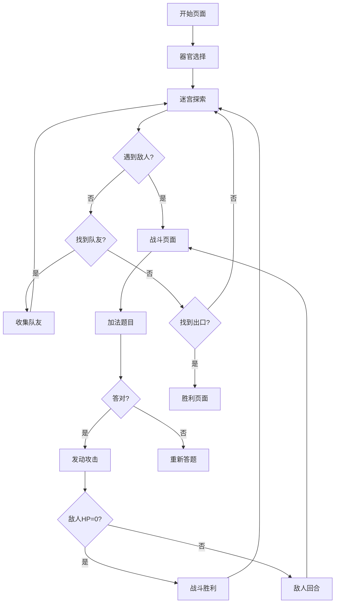

## 1. 产品概述
免疫英雄数学迷宫是一款专为4岁儿童设计的亲子协作教育游戏，通过免疫细胞与病原体战斗的趣味形式，帮助孩子学习10以内的加法运算。游戏结合迷宫探索、角色收集和简单的回合制战斗，让孩子在拯救人体的冒险中掌握基础数学技能。

游戏采用卡通化设计风格，避免任何血腥暴力元素，通过可爱的细胞角色和简单的加法题目，让孩子在父亲指导下享受学习的乐趣。

## 2. 核心功能

### 2.1 用户角色
| 角色 | 使用方式 | 核心权限 |
|------|----------|----------|
| 儿童玩家 | 直接游戏操作 | 控制免疫细胞移动、战斗答题、收集队友 |
| 家长指导 | 协助解释规则 | 指导游戏进程、解释数学题目、协助决策 |

### 2.2 功能模块
游戏包含以下核心页面：
1. **开始页面**：游戏标题、开始游戏按钮、简单操作说明
2. **迷宫页面**：动态生成的迷宫地图、角色移动、队友收集
3. **战斗页面**：回合制战斗界面、加法题目、骰子动画
4. **胜利页面**：关卡完成庆祝、数学能力反馈

### 2.3 页面详情
| 页面名称 | 模块名称 | 功能描述 |
|----------|----------|----------|
| 开始页面 | 游戏标题 | 显示"免疫英雄数学迷宫"标题和可爱的细胞角色动画 |
| 开始页面 | 开始按钮 | 点击开始新游戏，进入器官选择 |
| 开始页面 | 操作说明 | 显示简单的图文操作指南 |
| 迷宫页面 | 迷宫地图 | 动态生成10x10网格迷宫，包含通道和墙壁 |
| 迷宫页面 | 角色控制 | 使用方向键或点击移动主角免疫细胞 |
| 迷宫页面 | 队友收集 | 遇到其他免疫细胞时自动加入队伍 |
| 迷宫页面 | 敌人遭遇 | 遇到病原体时触发战斗 |
| 迷宫页面 | 进度显示 | 显示已收集的队友数量和当前关卡 |
| 战斗页面 | 角色信息 | 显示我方和敌方角色的HP、攻击力 |
| 战斗页面 | 骰子系统 | 2D骰子动画，随机生成1-6点数 |
| 战斗页面 | 加法题目 | 显示攻击力+骰子点数的4选1选择题 |
| 战斗页面 | 视觉辅助 | 用彩色圆点表示数值，便于点数计算 |
| 战斗页面 | 战斗结果 | 答对后显示攻击效果，答错显示鼓励信息 |
| 胜利页面 | 庆祝动画 | 显示胜利庆祝和获得的奖励 |
| 胜利页面 | 数学反馈 | 显示本次游戏解决的加法题目数量 |

## 3. 核心流程

### 游戏主流程
1. 玩家点击开始游戏，选择要探索的人体器官（如肺部、胃部等）
2. 进入动态生成的迷宫，控制主角免疫细胞移动
3. 在迷宫中寻找并收集其他免疫细胞队友
4. 遭遇病原体时进入战斗，需要解答加法题目
5. 答对题目后，攻击力+骰子点数大于敌方防御力则造成1点伤害
6. 击败敌人后继续探索，收集更多队友
7. 找到出口完成关卡，显示胜利界面和学习成果

### 战斗流程
1. 遭遇敌人时切换到战斗界面
2. 显示我方攻击力和骰子点数（1-6）
3. 显示加法题目："攻击力 + 骰子 = ?"，提供4个选项
4. 玩家选择答案，答对才能发动攻击
5. 计算总攻击值，与敌方防御力比较
6. 总攻击值大于防御力则造成1点伤害
7. 敌人HP降为0时战斗胜利

## 4. 用户界面设计

### 4.1 设计风格
- **主色调**：明亮的蓝色（#4A90E2）和绿色（#7ED321）代表健康，橙色（#F5A623）用于警告
- **按钮样式**：圆润的3D按钮，带有阴影效果，易于点击
- **字体**：使用圆润无衬线字体，主标题24px，正文18px，数字特别加大到28px
- **布局风格**：卡片式布局，每个功能模块用圆角卡片包裹
- **图标风格**：使用emoji和简单线条图标，保持儿童友好

### 4.2 页面设计概述
| 页面名称 | 模块名称 | UI元素 |
|----------|----------|--------|
| 开始页面 | 主视觉 | 大型免疫细胞角色动画，背景为淡蓝色人体轮廓 |
| 开始页面 | 标题区域 | 彩色渐变文字，带有星星装饰效果 |
| 迷宫页面 | 游戏区域 | 白色网格迷宫，绿色地板，灰色墙壁，占屏幕70% |
| 迷宫页面 | 状态栏 | 顶部显示当前关卡、收集进度，使用彩色图标 |
| 迷宫页面 | 控制区 | 底部显示方向控制按钮，大按钮设计便于点击 |
| 战斗页面 | 对战区域 | 左右分屏显示我方和敌方角色，中间显示VS |
| 战斗页面 | 题目区域 | 大号数字显示题目，4个大按钮显示选项 |
| 战斗页面 | 辅助区域 | 下方显示彩色圆点帮助计数，每个点代表1 |
| 胜利页面 | 庆祝区域 | 满屏彩色纸屑动画，大号"胜利"文字 |
| 胜利页面 | 统计区域 | 显示解决的题目数量和用时，用星星评级 |

### 4.3 响应式设计
- **桌面优先**：主要针对平板设备优化，支持横屏和竖屏模式
- **触摸优化**：所有按钮大小至少60px，适合儿童手指操作
- **自适应布局**：根据屏幕尺寸调整迷宫大小和UI元素比例

### 4.4 角色与场景设计
- **环境设计**：不同器官采用不同背景色调，肺部用浅蓝色，胃部用浅黄色
- **细胞角色**：圆形或椭圆形身体，大眼睛，可爱表情，每个细胞有独特颜色
- **病原体设计**：Q版造型，减少威胁感，用颜色区分危险等级
- **动画效果**：角色移动时有弹跳效果，战斗时有简单的闪光特效