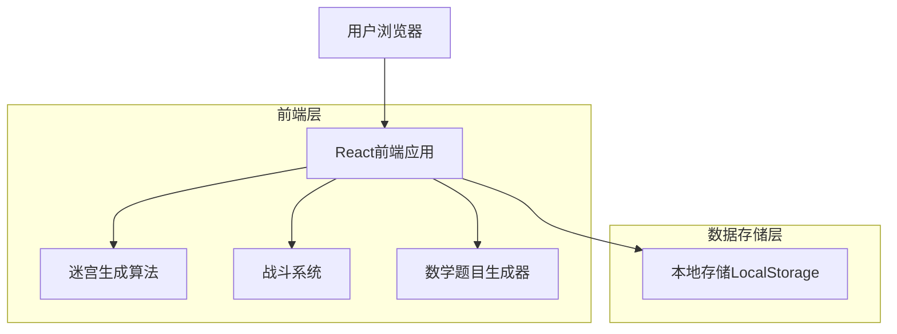
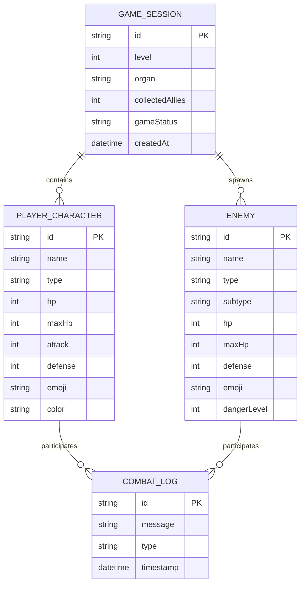

## 1. 架构设计



## 2. 技术描述

- **前端**: React@18 + TailwindCSS@3 + Vite
- **初始化工具**: vite-init
- **状态管理**: React Hooks (useState, useEffect, useContext)
- **动画库**: Framer Motion (轻量级动画)
- **数学渲染**: 原生JavaScript数学运算
- **存储**: 浏览器LocalStorage (游戏进度保存)
- **后端**: 无后端服务，纯前端应用

## 3. 路由定义

| 路由 | 用途 |
|------|------|
| / | 游戏主页，显示开始界面 |
| /game | 游戏主界面，包含迷宫探索和战斗 |
| /victory | 胜利界面，显示关卡完成信息 |

## 4. 核心数据类型定义

### 4.1 角色类型定义
```typescript
interface Character {
  id: string;
  name: string;
  type: 'macrophage' | 'neutrophil' | 'tcell' | 'bcell' | 'nkcell';
  hp: number;
  maxHp: number;
  attack: number;
  defense: number;
  emoji: string;
  color: string;
}

interface Enemy {
  id: string;
  name: string;
  type: 'bacteria' | 'virus' | 'parasite';
  subtype: string; // 'e_coli', 'influenza', 'ebola'等
  hp: number;
  maxHp: number;
  attack: number;
  defense: number;
  emoji: string;
  dangerLevel: 1 | 2 | 3; // 危险等级
}
```

### 4.2 游戏状态类型
```typescript
interface GameState {
  currentLevel: number;
  currentOrgan: string;
  playerTeam: Character[];
  maze: MazeCell[][];
  playerPosition: Position;
  enemies: Enemy[];
  collectedAllies: number;
  gameStatus: 'playing' | 'combat' | 'victory' | 'defeat';
}

interface Position {
  x: number;
  y: number;
}

interface MazeCell {
  x: number;
  y: number;
  isWall: boolean;
  hasAlly: boolean;
  hasEnemy: boolean;
  isExit: boolean;
}
```

### 4.3 战斗系统类型
```typescript
interface CombatState {
  isActive: boolean;
  playerCharacter: Character;
  currentEnemy: Enemy;
  diceRoll: number;
  question: MathQuestion;
  selectedAnswer: number | null;
  combatLog: CombatLogEntry[];
}

interface MathQuestion {
  operand1: number; // 攻击力
  operand2: number; // 骰子点数
  correctAnswer: number;
  options: number[]; // 4个选项
}

interface CombatLogEntry {
  message: string;
  type: 'attack' | 'damage' | 'miss' | 'victory';
  timestamp: number;
}
```

## 5. 核心算法设计

### 5.1 迷宫生成算法
使用递归回溯算法生成完美迷宫：
```typescript
function generateMaze(width: number, height: number): MazeCell[][] {
  // 初始化所有单元格为墙
  // 从起点开始递归访问相邻单元格
  // 随机选择未访问的邻居，打通墙壁
  // 确保存在从起点到终点的路径
}
```

### 5.2 数学题目生成器
生成适合4岁儿童的加法题目：
```typescript
function generateMathQuestion(attack: number): MathQuestion {
  const diceRoll = Math.floor(Math.random() * 6) + 1;
  const correctAnswer = attack + diceRoll;
  
  // 生成3个错误选项
  const wrongAnswers = generateWrongOptions(correctAnswer, attack);
  const options = shuffle([correctAnswer, ...wrongAnswers]);
  
  return {
    operand1: attack,
    operand2: diceRoll,
    correctAnswer,
    options
  };
}
```

### 5.3 战斗判定逻辑
```typescript
function calculateCombatResult(
  playerAttack: number,
  diceRoll: number,
  answerCorrect: boolean,
  enemyDefense: number
): CombatResult {
  if (!answerCorrect) {
    return { hit: false, damage: 0, message: "答案不正确，重新尝试！" };
  }
  
  const totalAttack = playerAttack + diceRoll;
  if (totalAttack > enemyDefense) {
    return { hit: true, damage: 1, message: "攻击成功！" };
  } else {
    return { hit: false, damage: 0, message: "攻击被防御了！" };
  }
}
```

## 6. 数据模型

### 6.1 游戏数据模型


### 6.2 LocalStorage数据结构
```typescript
// 游戏进度保存
interface SavedGame {
  gameState: GameState;
  lastSaved: number;
  totalQuestionsAnswered: number;
  correctAnswers: number;
  bestTime: number;
}

// 角色数据库（预定义）
const IMMUNE_CELLS: Character[] = [
  {
    id: 'macrophage',
    name: '巨噬细胞',
    type: 'macrophage',
    hp: 5,
    maxHp: 5,
    attack: 3,
    defense: 2,
    emoji: '🔰',
    color: '#4A90E2'
  },
  {
    id: 'neutrophil',
    name: '中性粒细胞',
    type: 'neutrophil',
    hp: 4,
    maxHp: 4,
    attack: 4,
    defense: 1,
    emoji: '⚡',
    color: '#F5A623'
  },
  {
    id: 'tcell',
    name: 'T淋巴细胞',
    type: 'tcell',
    hp: 3,
    maxHp: 3,
    attack: 2,
    defense: 3,
    emoji: '🎯',
    color: '#7ED321'
  }
];

const PATHOGENS: Enemy[] = [
  {
    id: 'e_coli',
    name: '大肠杆菌',
    type: 'bacteria',
    subtype: 'e_coli',
    hp: 2,
    maxHp: 2,
    attack: 2,
    defense: 2,
    emoji: '🦠',
    dangerLevel: 1
  },
  {
    id: 'influenza',
    name: '流感病毒',
    type: 'virus',
    subtype: 'influenza',
    hp: 1,
    maxHp: 1,
    attack: 3,
    defense: 1,
    emoji: '🦠',
    dangerLevel: 2
  }
];
```

## 7. 组件架构

### 7.1 主要React组件
```typescript
// 页面级组件
App.tsx                 // 主应用组件，路由管理
HomePage.tsx           // 开始页面
GamePage.tsx           // 游戏主页面
VictoryPage.tsx        // 胜利页面

// 功能组件
Maze.tsx               // 迷宫渲染组件
Character.tsx          // 角色显示组件
CombatSystem.tsx       // 战斗系统组件
MathQuestion.tsx       // 数学题目组件
DiceRoller.tsx         // 骰子组件
ProgressBar.tsx        // 进度条组件

// 工具组件
LocalStorageManager.ts // 本地存储管理
MazeGenerator.ts       // 迷宫生成器
MathQuestionGenerator.ts // 题目生成器
```

### 7.2 状态管理结构
```typescript
// 使用React Context进行全局状态管理
interface GameContextType {
  gameState: GameState;
  combatState: CombatState | null;
  startNewGame: (organ: string) => void;
  movePlayer: (direction: Direction) => void;
  startCombat: (enemy: Enemy) => void;
  answerQuestion: (answer: number) => void;
  saveProgress: () => void;
  loadProgress: () => void;
}
```

## 8. 性能优化

### 8.1 渲染优化
- 使用React.memo优化迷宫单元格重渲染
- 虚拟化长列表（如战斗日志）
- 图片懒加载和缓存策略

### 8.2 算法优化
- 迷宫生成使用迭代而非递归，避免栈溢出
- 数学题目预生成和缓存机制
- 战斗状态使用不可变数据更新

### 8.3 存储优化
- LocalStorage数据压缩和分片存储
- 定期清理过期游戏数据
- 使用IndexedDB存储大量历史数据